# ReadingSummary
提升能力，保持耐心。

认真阅读每本书，做好阅读笔记和思考，转为存量

版权申明：项目中会提供一些电子书籍，分享给自己和后续读者。书籍版权属于对应作者所有，后续读者仅能用于个人学习相关，不可作为商用，否则侵权带来的法律和经济问题由读者个人承担，与本人无关。

TODO书籍

- 刻意练习
- 超越感觉

## 《认知觉醒》

### 第一章 大脑 - 一切问题的起源

#### 第一节 大脑：重新认识你自己

三重大脑

- 本能脑：基于原始的反射模块，可快速队环境作出本能反应。约3.5亿年前爬行动物演化而来
- 情绪脑：大约2亿年前，进化出情绪脑。情绪的加持，哺乳动物能有效再恶劣环境下趋利避害。比如恐惧让自己远离，兴奋让自己专注等
- 理智脑：约250万年前，大脑的前额区域进化出“新皮层”，产生了理性思维，如语言、理解力、科技等

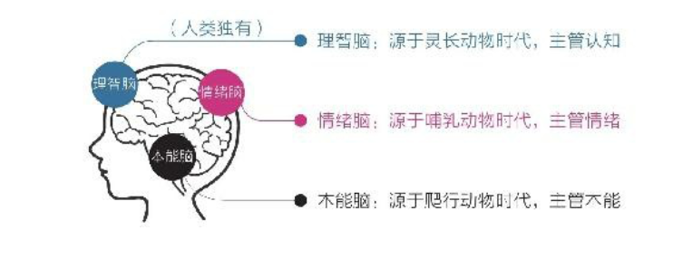

人类大脑由内而外至少有三重大脑：年代久远的本能脑、相对古老的情绪脑和非常年轻的理智脑。

理智脑非常高级，但是比起本能脑和情绪脑相对弱小，且从孩子发育成熟时间也不同，本能脑是早期婴儿时期就比较完善（大约2岁），情绪脑是青春期才趋于完善（大约12岁），理智脑要到成年（大约22岁）。

本能脑、情绪脑的神经元细胞和计算速度远远高于理智脑，所以生活中我们大部分决策往往源于本能和情绪，而非理智。

本能脑、情绪脑的基因一直被原始社会的生存压力塑造着，它们的天性自然形成了目光短浅、即时满足。这也导致人类的默认天性就是避难趋易和急于求成。

- 避难趋易：只做简单和舒适的事，喜欢在核心区域周边打转，待在舒适区内逃避真正的困难
- 急于求成：凡事希望立即看到结果，对不能马上看到结果的事往往缺乏耐心，非常容易放弃

人，生来混沌。根本原因在于出生时我们的理智脑太薄弱，无力摆脱本能脑和情绪脑的压制和掌控，而觉醒和成长就是让理智脑尽快变强，克服天性。很多人在成长的过程中感到极度痛苦，因为他们一直想着用意志力去对抗本能和情绪，最后搞得筋疲力尽，收益甚微。我们因掌握科学方法，有序利用理智脑，来驱动本能和情绪，达到利益最大化。

#### 第二节 焦虑：焦虑的根源

直面焦虑

- 做总比不做强。不要担心是否来不及
- 焦虑有五种形式
  - 完成焦虑：每天安排太多的任务，永远活在截止期限中
  - 定位焦虑：自己时零基础阶段，就希望和领域专家相比，产生极强的挫败感
  - 选择焦虑：选择太多，无法抓住主要矛盾，让人陷入选择矛盾中。人喜欢唯一性和确定性，面对多元和不确定，靠天生的习性很难应付
  - 环境焦虑：外在的环境限制，如家庭和工作影响，有些想做的事做不了
  - 难度焦虑：有些专业技能和知识很难懂，也很难学。真正能让你变强的东西，核心困难时无法回避的，必须下定决心与之死磕，始终周围打转，会一直焦虑

焦虑根源

- 根本原因就两条：想同时做很多事，又想立即看到效果。
- 人类大脑的焦虑是天性，是人类的默认设置。人类的默认天性就是避难趋易和急于求成，急于求成，就是想同时做很多事；避难趋易，就是想不怎么努力就立即看到效果。

如何解决焦虑：关键在于真正提升能力和保持耐心

#### 第三节 耐心：得耐心者得天下

要想有所成就，必须保持耐心，延迟满足。

缺乏耐心，是人类的天性：社会中的精英通常是那些能更好的克服天性的人，他们的耐心水平更高，延迟满足的能力更强。耐心是来自于理智脑的控制

认识规律，耐心的倍增器

- 对于一些困难的事物，我们需要冷静的面对前期缓慢的增长兵坚持到拐点
  - 复利曲线：前期增长非常缓慢，但到达一个拐点后会飞速增长
  - 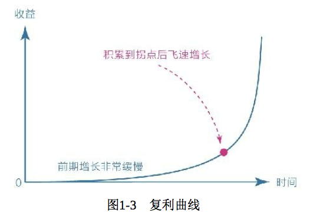
- 要选择正确的方向，并在积累的过程中遵循刻意练习的原则，在舒适区边缘一点一点地扩展自己的能力范围
  - 舒适区边缘：无论个体还是群体，其能力都以“舒适区-拉升区-困难区”
  - 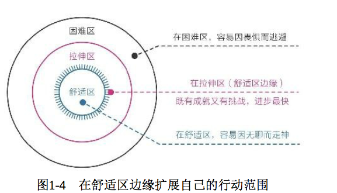
- 成长权重比：对于学习成长而言，每个人都必须重视成长权重比，否则就会陷入自我感动、自我怀疑、读过很多本书却只是走过场的困境。
  - 成长权重比揭示了“学习、思考、行动和改变”的关系：对于学习而言，学习后的思考、思考后的行动、行动后的改变更重要。如果不把握住内层的改变量，那么表层投入再多的学习也是徒劳。
  - 从权重的角度来看：改变量>行动量>思考量>学习量
  - 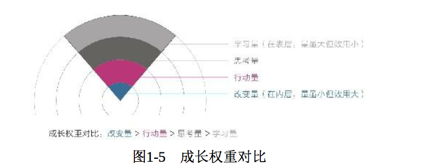
  - 很多人痛苦焦虑，就是因为只盯着表层的学习量。这也是人类的避难趋易的天性原因，表层的学习是最简单的，也是最容易得到满足的。
- 平台期：学习进展和时间的关系并不是线性关系，而是一种波浪式上升曲线
  - 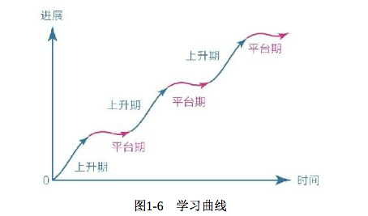
  - 几乎所有的学习都是这样，刚开始的时候进步很快，然后会变慢，进入平台期。平台期需要我们花费大量的努力突破，所以在平台期需要有耐心，慢慢积累等待下一次上升期的到来。
- 总结：耐心不是毅力带来的结果，而是具有长远目光的结果。这也侧面说明，我们为什么需要终身学习，只有学习掌握的知识越多和规律越多，才能增强自己持续行动的耐心。

怎样拥有耐心？

- 急于求成的人类默认天性，我们要面对天性，放下心理包袱，坦然接纳缺乏耐心的自己
- 面对诱惑，学会延迟满足，变对抗为沟通
  - 舒适和诱惑是本能脑与情绪脑的最爱，失败是常有的事。要学会利用理智脑去沟通，延迟满足，以获得更大的舒适感和成就感。
- 面对困难，主动改变视角，赋予行动意义
  - 比如，我们清楚阅读带来的本质，就会放下手机，主动拿起书本。

### 第二章 潜意识 - 生命留给我们的彩蛋

#### 第一节 模糊：人生是一场消除模糊的比赛

为了更好的生存，人类在进化过程中巧妙地采用意识分层的手段

-  潜意识负责生理系统
- 意识负责社会系统

意识分层来带一个巨大的副作用 - 模糊。意识很难介入潜意识，而潜意识却很容易左右意识。

- 什么是模糊：人类自己不理解的事

学习知识，消除认知模糊

- 人类的认知能力需要从零开始积累，掌握的工具和知识越多，消除模糊的能力就越强
- 不幸的是，人类天生不喜欢消耗高的学习和思考，潜意识就会排斥，并诱导我们娱乐、享受，所以本能通常阻碍我们学习。
- 学习知识的目的是“消除模糊”，而获取知识的方法也是“消除模糊”，目的和方案相统一
- 凡事不要凭模糊的感觉判断，要寻找清晰的证据
- 总结：提升思考能力的方法正式不断明确核心困难和心得感悟，并专注于此

拆解烦恼，消除情绪模糊

- 认知模糊来自于内部，而情绪模糊来自于外界
- 多数人为了逃避真正的思考，愿意做任何事情。
- 回避痛苦并不能使痛苦消失，反而会使其转入潜意识，变成模糊的感觉。
- 真正的困难总要比想象的要小很多。人们的拖延、纠结、畏惧、害怕的根本原因往往不是事情本身有多难，而是内心的想法变得模糊
- 任何痛苦并不会自动消失，要想不受其困扰，唯一的办法就是正视它、看清它、拆解它、化解它，不给它进入潜意识的机会

里外分明，消除行动模糊

- 认知清晰，情绪平和，最终都要行动坚定
- 很多人把行动力不足的原因归结于环境干扰、意志力薄弱，其实，行动力不足的真正原因是选择模糊
- 选择模糊就是一种不确定性，而人类面对不确定性时会不自觉逃避，
- “逃避不确定性“被写入到我们的基因中，当我们没有足够清晰的指令或者目标时，就会很容易选择享乐，放弃那些本该坚持但比较烧脑的选项

#### 第二节 感性：顶级的成长竟然是“凭感觉”

潜意识的智慧

- 潜意识没有思维，只关心眼前的事物，喜欢即刻、确定、简单、舒适，这是属于天性的部分
- 另外，潜意识处理信息极快，能极其敏锐地感知很多不易觉察的信息，这个是其感性部分
- 很多时候，有的人能捕捉到潜意识发出的那一丝微弱的信号，这就是所谓的“凭感觉” -- 察觉潜意识发出的信息

凭感觉学习

- 熔断不读书：读书时一旦看到有启发的内容，就触发熔断点，立即停止读书。停止读书之后，给自己提问
  - 为什么刚才这个点让我有启发？
  - 我能够把这个启发点用在3个不同的事情上吗？
  - 这个启发点有没有其他类似的知识？
- 高手学习方法：先用感性能力帮助自己选择，再用理性能力帮助自己思考
- “凭感觉学习“之所以被称为顶级的方法，是因为它能帮我们感知真正适合自己并需要的东西，让自己一直处于学习的”拉伸区“
  - 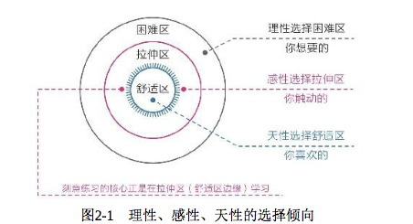
- 更好的读书方法或许是读完整本书后过几天再问自己：现在你印象最深的触动点是什么？牢牢抓住这个触动点，去关联、去实践，就会获得最大的收获。

凭感觉寻找人生目标

- 一个人如何没有人生目标，纵然有丰富的物质生活，内心也会厌恶自己。目标是存放我们热情和精力的地方
- 人生目标如果是依靠理性思维权衡利弊和考量得失之后的结果，其动机往往来自“自我索取和外在评价”，时间一长，很容易使人迷失方向，使动力枯竭
- 先用感性选择，再用理性思考，或许是一个更好的策略。真正的觉醒者往往会有意无意的用感知力来代替思考力

如何捕捉感性

- “最”字法
  - 关注那些最触动自己的点：让你眼前一亮、心中泛起波澜的人和事
- “总”字法
  - 平时脑子里总是不自觉跳出来的某些重复念头，或是心头总是挥之不去的事，这些通常是我们心中最放心不下的事，或是情绪波动的源头
- 无意识的第一反应
  - 关注自己第一次见到某个人、第一次走进某个房间时，心中出现瞬间反应或第一个念头。
- 梦境
  - 梦境是潜意识传递信息的一种方式，它可能是内心真实想法的展示，也可能是灵感的启发
- 身体
  - 无论生理还是心理上的不适，都会通过身体如实地反映出来
- 直觉

### 第三章 元认知 - 人类的终极能能力

#### 第一节 元认知：成长慢，是因为你不会“飞”

“万物之灵”的根源

- 元认知，就是最高级别的认知，它能对自身的“思考过程”进行认知和理解
- 元认知本质上，就是我们习以为常、见怪不怪的反思能力
- 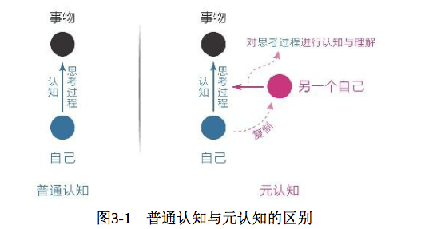

元认知能力的差异

- 为什么人人都有反思能力，但人与人之间的差别却如此之大？原因在于：元认知能力也是有层级的，唯有拥有更高级的元认知的人才能胜出

- 元认知至少可分为六个等级，最终可分为两类

  - 被动元认知：普通人遇到问题时被迫启用这个能力，比如遭遇指责、批评等；处于顺境时，则会依着本性生活，享受生活
  - 主动元认知：从被动到主动，不停的进化和思考。当一个人能主动开启第三视角、开始持续反观自己的思维和行为时，就以为着他真正开始觉醒了

元认知如何改变我们的命运

- 反观，是元认知的起点。
- 你能意识到自己在想什么，进而意识到这些想法是否明智，再进一步纠正那些不明智的想法，最终作出更好的选择
- 高级的元认知：时刻帮你从高处、深处、远处看待现在的自己，让自己保持清醒、不迷失，保持动力、不懈怠，保持平和、不冲动
  - 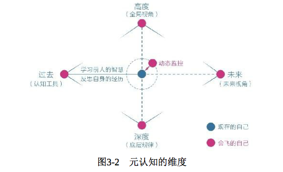

如何获取元认知能力

- 从图3-2可以看出，提升元认知能力的工具需要从“过去”端获取，包括学习前人的智慧和反思自身的经历
  - 读前人的书籍，了解书中智慧
  - 关注脑科学和认知科学，帮助我们理解自己的大脑，直接观察我们自己
- 自身的经历更是一种独特的财富
- 冥想
  - 那种只要静坐在某处，然后放松身体，把注意力完全集中到呼吸和感受上的活动
  - 启用你的“灵魂伴侣”：监控自己的注意力，然后将其集中自己需要关注的地方

#### 第二节 自控力：我们生而为人就是为了成为思维舵手

元认知能力被称为人类的终极能力。自我觉察只是元认知能力的基本盘，在实际生活中，元认知能力还能在自我控制方面提供强大的指导

- 元认知能力就是觉察力和自控力的组合
- 元认知能力可以被重新定义为：自我审视、主动控制，防止被潜意识左右的能力

成长就是为了主动控制

- 随着我们从婴儿不断长大，大脑的前额皮质开始发育，理智脑的战斗力才慢慢增强
- 理智脑的战斗力主要表现在两个方面
  - 一方面是侧重学习、理解、记忆、运算的认知能力。即我们在学校学习的知识
  - 另一方面则是侧重观察、反思、判断、选择的元认知能力
  - 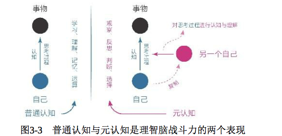
- 掌握大脑的主动权的明显特征是：能够主动控制注意力，不会被随机、有趣的娱乐信息随意支配
- 建议：每当遇到需要选择的情况时，我们要先停留几秒思考，激活自己的理智脑，启用元认知来审视当前的思维，然后做出不一样的选择
- 锻炼自己的元认知方法：一定要在选择节点上多花“元时间”

成为自己人生的思维舵手

- 元时间通常分布在“选择的节点”上，比如一件事情、一个阶段或一天开始活结束时。善用这些时间会极大程度地优化后续时间的质量
- 元时间只做一件事：想清楚。在选择的节点审视自己的第一反应，并产生清晰明确的主张
- 元认知能力强的一个突出表现是：对模糊零容忍。任何时候，想尽一切办法让自己找出那个最重要的、唯一的选项

### 第四章 专注力 - 情绪和智慧的交叉地带

#### 第一节 情绪专注：一招提振你的注意力

分心走神的原因

- 分心走神的原因
  - 觉得当下太无聊，所以追求更有意思的事情
  - 觉得当下太痛苦，于是追求更舒适的事情

收回感受，回归当下

- 让感受回归行动。跑步时，把感受收回来，悉心体会抬腿摆臂、呼吸吐纳
- 身体感受永远是进入当下状态的最好媒介，而感受事物消失的过程更是一种很好的专注力训练
- 身心合一的要领：专注于当下，更是享受当下

#### 第二节 学习专注：深度沉浸是进化双刃剑的安全剑柄

人类情绪和能力优劣的根本差异

- 智者都是让自己的情绪和能力处于平和和高效的状态
- 人类情绪和能力优劣来自于对自身注意力关注方式的差异：能力强者能主动屏蔽干扰，选择需要的信息并沉浸在其中

深度沉浸的方法

- 第一，有定义明确的目标
  - 目标定义越清晰，注意力的感知精度久越高。
  - 定义的目标应有实质性收益和提
- 第二，练习时极度专注
  - 大脑学习时有两种模式
    - 一种是”意识“的专注模式
    - 另一种时“潜意识”的发散模式
    - 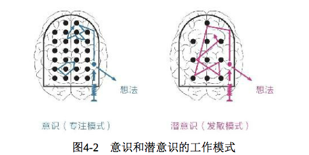
  - 变聪明的秘诀：先保持极度专注，想不出答案时再将注意力转换到另一件与此事毫不相干的事情
- 第三，能获得有效的反馈
  - 无论做什么事，我们都需要反馈来准确识别自己在哪些方面还存在不足，以及为什么会窜在不足
  - 所以，想方设法得到及时、有效的指导和反馈是不断精进的重要条件。如果条件有限，反馈可以通过书籍影像、与他人交流或自我反思来获取
- 第四，始终在拉伸区练习
  - 当人们对当前的活动感到厌倦时，说明应该提升难度
  - 当人们对当前的活动感到焦虑时，说明应该保持这个水平专注联系。
  - 上述两个状态如此反复交替，就可以让自己进入心流通道
  - 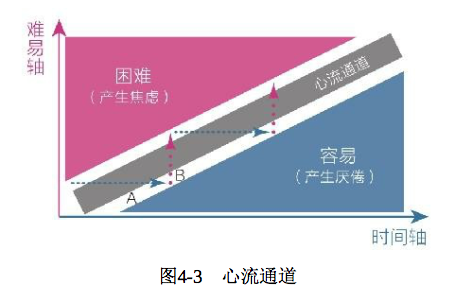
  - 我们每天都要做那些让自己感到有些困难但又可以通过努力来完成的事，即跳出舒适区，避开困难区，处于拉伸区
- 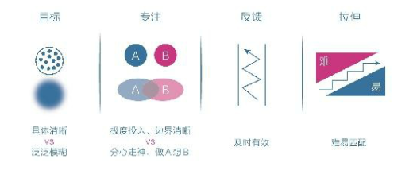

### 第五章 学习力 - 学习不是一味地努力

#### 第一节 匹配：舒适区边缘，适用于万物的方法论

刻意练习的核心在于：**难易匹配**

好的成长是始终游走在“舒适区边缘”

- 理想的状态是持续获取与自己当前能力相匹配的财富和自由
- 只要我们遵循匹配规律，不断在舒适区边缘拓展自己，同时愿意与时间做朋友，那么我们注定可以持续成长，重塑自己

一切为了匹配

- 刻意练习的四要素看上去各自独立，实际上环环相扣、互连互通，而且它们最终都指向匹配
- 第一个要素“目标”，它能帮我们解决行动力中的最大问题。
  - 学会拆解目标。把大的任务拆分成小任务，将任务从困难区转移到拉升区
  - 在拉伸区的一大特点就是要有关注点。关注点越多、越细致，我们注意力就越集中。
  - 跳出舒适区最好的办法就是区发现和收集要点，也就是每次行动的小目标。比如，不断练习错题，直到我们考到高分。

#### 第二节 深度：深度学习，人生为数不多的好出路

何为深度学习

- 人的学习分为被动学习和主动学习
- 被动学习：如听讲、阅读、视听、演示。这些活动对于学习内容的平均留存率为5%、10%、20%和30%
- 主动学习：如通过讨论、实践、教授他人，学习内容的留存率可达到50%、75%和95%
- 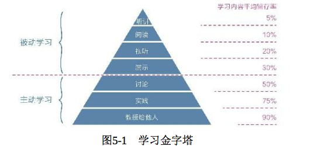
- 深层次一点的是：读完书能去实践书中的道理，哪怕有那么一两点内容让生活发生了变化，也是很了不起的，因为从这一刻开始，书本中的知识得到了转换
- 浅层学习满足输入，深度学习注重输出。

如何深度学习

- 获取高质量的知识：尽可能获取并亲自专研一手知识
- 深度缝接新知识：尽可能的用自己的话把所学知识写出来
  - 每读完一本有价值的好书，运用写作的方式把作者的思想结合自己经历、学识、立场，去理解、去延伸的写出来
- 输出成果去教授：将所学到的知识，运用到生活中，不断反思教育自己和他人

深度学习的好处

- 深度学习除了能让我们不再浮躁，能磨炼理智，还能带来诸多好处，比如跨界能力的提升
  - 人的能力分为知识、技能和才干。其中知识和技能不同的专业很难完成迁移，才干层面职业之间的界限就完全打破了
  - 通过深度学习已经拥有了某些才干，而这些才干在其他行业领域也同样适用
- 深度学习还能让人产生更多的灵感
  - 只有在自己的领域探索的足够深入时，灵感才可能在潜意识的帮忙下显现
  - 深度学习还能让我们看到不同事物之间的更多关联，产生洞见。身边的一些琐事，可能会充分调动高级认知，把它们与有益的思考关联起来，产生更深刻、更独特的见解

为浅学习正名

- 并不是说不需要浅学习。因为深度学习与浅学习不冲突，浅学习也有其价值，**关键是不要搞反它们的权重关系**
- 浅学习可以用来了解新信息的入口，但并不能把学习成长的需求全部寄托于此
- 合理的态度是：专注于深度学习，同时对浅学习保持开放

#### 第三节 关联：高手的“暗箱”

无关联，不学习

- 《这样读书就够了》中提出读书的三个步骤
  - 用自己的语言重述信息，即找到触动自己的信息点
  - 描述自己的相关经验，即关联生活中其他知识
  - 我的应用，即转化为行动，让自己切实改变
- 知道信息点事最浅的层次，完整、深入的学习还包括关联和行动。
- 很多人遨游在知识的海洋中，始终无法进阶，这是因为他们永远没有深入的关联和行动
- 聪明的人更喜欢拨弄信息之间的关联，从而在不知不觉中找到灵感。而大多数人习惯以孤立的思维看待事物，喜欢花大量时间收集和占有信息

事不关己，不关联

- 知识的获取不在于多少，而在于是否与自己有关联，以及这种关联有多充分。
- 把握“与自己有关”的筛选原则，让关联效能大大提升

如何获取关联能力

- 关联能力能够让人加速演化，获取杠杆，找到爆发点
- 获取关联能力有几条实现路径
  - 首先，手中有锤子
  - 其次，输入足够多
  - 再次，保持好奇心
  - 最后，但凡收获一个感悟、了解一个观点或学到一个知识，只要是触动了自己，就要想办法让它效率最大化，而效率最大化的办法就是主动关联到别处，并使自己的行为发生变化

一切在于主动

- 从今日起，请重新认识“关联”，主动运用它、传递它。像瓦特关联了壶盖，牛顿关联了苹果，爱因斯坦关联了钟

#### 第四节体系：建立个人认知体系其实很简单

知识与认知的区别

- 真正的知识不是你知道它，而是能运用它帮助自己做出正确的判断和选择，解决实际问题。这一点正是知识和认知的区别
- 我们在高中、大学课本上学习的概念、公示、原理、案例都是属于知识，真正的认知是能够帮助你做实际决策

只学让自己触动的

- 在阅读时，唯一要做的事情就是：寻找触动点。然后在触动自己的地方，关联大量的事，融入自己的知识体系中
- 体系的本质就是用独特的视角将一些零散的、独立的知识、概念或观点整合为应对整个世界的方法和技巧。高手们会根据自己的关注点，不断收集该领域内触动自己的信息，形成独特的认知体系

触动时最好的筛选器

- 触动学习法：利用潜意识的感性能力，通过情绪触动，识别与自身需求结合最紧密的内容，不断在舒适区的边缘寻求突破

仅仅触动还不够

- 生活中，很多触动都是“伪触动”。如何不及时强化，新的触动点很快就消失了。那样并没有很好的收获
- 
- 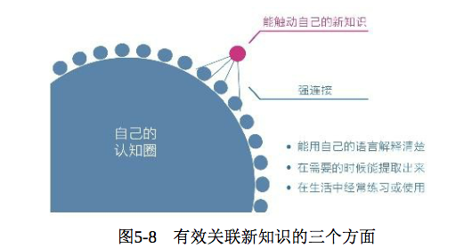
- 有效关联新知识的三个方面
  - 一是用自己的语言重新解释新知识，并教授他人。这会促使自己原有的知识体系对新知识做出反应
  - 二是需要的时候能够顺利提取知识，提取不出来的知识就是伪触动
  - 三是生活中能够经常练习或使用这些知识，因为实践是产生强关联的终极方法
    - 学习不是为了知道，而是为了终极的改变

#### 第五节 打卡：莫迷恋打卡，打卡打不出未来

动机转移，动力扭曲

认知闭合，效能降低

- 单纯依赖打卡，不仅会转移行动的动机，还会降低行动的效能。这源自另一个重要的心理机制 --- 认知闭合需求
- 认知闭合需求
  - 当人们面对一个模糊的问题时，就有给问题找出一个明确答案的欲望
  - 一件事若迟迟没有完成，心里就总是记挂，期盼着早点结束；此事一旦完成，做这件事的动机就会立即趋向于零

任务心态，身心分裂

- 个人学习成长领域，任务心态或许并不可取
  - 比如，跑步时总是想着还剩多少时间可以结束，读书时想着还剩多少页可以完成。这样的心态会使注意力分散，无法全身新投入事物本身
- 现代人很难获取的幸福感，多是因为这种快节奏和急心理。在这样状态下，生活何其枯燥，无法让我们享受过程，只会让身心紧张、焦虑、麻木和分裂
- 想破除任务心态的方案 ----- 集中心力做眼前的事

两个策略，轻松改变

- 任务设置时使用新策略：设下限，不设上限
  - 这样做的好处是：让我们完成目标毫无负担，且此时刚好进入学习状态，精力旺盛，就愿意继续顺着惯性学习下去

#### 第六节 反馈：是时候告诉你什么是真正的学习了

是否有及时、持续的正向反馈，正是产生学习效果差异的关键。

无反馈，不学习

- 所有处于类似困境中的学习者，无论是在校的还是在职的，无不认为只要自己努力地输入，不停地学，就一定有所成，然而现实总是令他们失望
- 科学的学习策略是产出作平、获取反馈，驱动本能脑和情绪脑去“玩玩玩”，而不是一味地努力坚持，让理智脑苦苦地去“学学学”
- 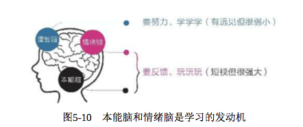

有作品意识才有未来

- 一个拥有清晰而强烈的作品意识，会更加重视输出和运用，会倾心打磨作品，主动换取外界的反馈
- 去产出点什么，要么去说，要么去写，要么去分享视屏，总之得有输出

痛苦也是一种反馈

- 很多人的分享，可能会收到很多批评或嘲笑，但失败也是一种反馈
- 分享建议做到以下三点，就不会难迈出步子了
  - 首先，分享不是随意分享半成品，而是尽最大力气将作品打磨成自己当前能力范围内可完成的最好样子
  - 其次，制定分享策略，展示给那些能力不及你的人
  - 最后，冷静客观地对待打击
  - 记住：所有痛苦都是上天给我们的成长提示

真正的学习成长不是“努力，努力再努力”，而是“反馈，反馈再反馈”

#### 第七节 休息：你没成功，可能是因为太刻苦了

主动休息的秘密

- “刻意练习四要素”：定义明确的目标、极度的专注、有效的反馈、在拉伸区练习
- 刻苦者看似无比勤奋，可效果却越来越差，过程中感受到的多是痛苦而不是乐趣
- 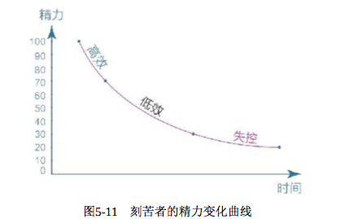
- 不要过度消耗自己，只要感到精力不足，就停下来主动休息，这反而使他们精力桶的水位得到快速回升
- 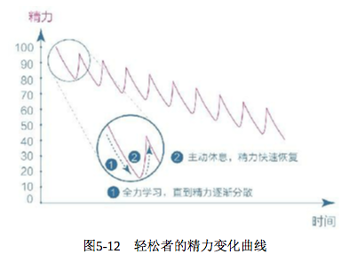

保持专注的危机

- 不难发现，高效学习的关键在于保持极度的专注，而不是靠意志力苦苦支撑
- 更科学的模式：极度专注 + 主动休息，如此反复
- 保持专注并不能仅靠意志力约束，还要靠主动休息“回血”，只有精力充沛，我们才能保持专注

意志失控的根源

- 精力，在某种程度上可以作为意志力的代名词
- 一个真正的自控高手，不是一个只知道冲刺的人，而是一个善于主动休息、保持平衡的人

能拯救你的“番茄”

- 番茄工作法：先极其专注地工作25分钟，然后休息5分钟，如此循环往复
- 极度专注、主动休息、循环往复

### 第六章 行动力 - 没有行动世界只是个概念

#### 第一节 清晰：一个观念，重构你的行动力

珍惜每天的礼物

- 每天清晨，我们都会收到一份礼物：纯净的注意力
- 世界有一个底层的系统规律叫“增强回路”：最初的选择会影响行为自动增强的方向
- 所以，我们建议每天上午，先去读书、锻炼，或者做些重要的工作，精力就会呈聚合状态，并且会自动增强
- 在初始阶段，强迫自己先做重要的事情，一旦进入正向的增强回路，便能拥有强大的行动力 ----- 这正是增强自制力、提升行动力的秘密

清晰力才是行动力

- 清晰力，也就是把目标细化、具体化的能力 ----- 行动力只有在清晰力的支持下才能得到重构

成长是个系统工程

- 从某种程度上说，有自己热爱的事，比行动力本身要重要的多

一切源于“想清楚”

-  你陷入怠惰、懒散、空虚的情绪中动弹不得时，往往是因为你的大脑处于模糊状态

#### 第二节 “傻瓜”：这个世界会奖励那些不得失的“傻瓜”

成长中的悖论

- 想先看奥结果再行动的人往往无法看到结果
- 事实上，只要道理正确，就别在乎那些小聪明，带着不计得失的心态向前走，你就会发现目标越来越清晰
- 
- 很多时候，在能主动做成一件事之前，我们眼里的世界是二维的、扁平的。然而在能主动做成一件事情之后，我们就能够从侧视的角度，看到三维的、立体的世界
- 我们一直强调“想清楚”的重要性，但当我们绞尽脑汁去想却仍然想不清楚的时候，就要依据前人的假设现行行动

突破阀值

- 我们在行动的时候，要专注、要持续行动，直到突破阀值，这样才能看到更高层次的风景
- 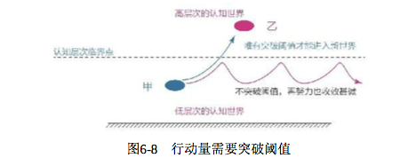

#### 第三节 行动：“道理都懂，就是不做”怎么破解

认知，其实是一种技能

- 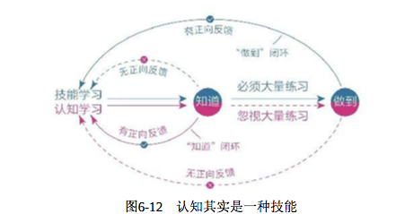
- 把认知当成一种技能，知道或者想通一个道理时，不要高兴太早，想想后面还要做大量的练习，这样就不浮躁了

一开始做不好很正常

- 很多人不愿意行动的另一个原因是：在开始尝试的时候，总觉得自己做的不好，看不到明显的效果，然后就放弃了
- 要相信，只要不断练习，神经元之间的必然会越来越强，即使你感觉自己暂时在退步，也不要气馁，因为你可能进入了学习的平台期

我们能做的其实很少

- 通常要做好、做成一件事，需要花费大量的心力和精力，我们真正能做的事情事情其实非常少
- 不发生真正改变的学习都是无效的学习。真正的成长不在于自己懂得了多少道理，而在于自己改变了多少
- 道理都是“空头支票”，改变才是“真金白银”。当凡事都以改变为标准时，你的成长路径会更加清晰

### 第七章 情绪力 - 情绪是多角度看问题的智慧

#### 第一节 心智带宽：唯有富足，方能解忧

稀缺心态，让人变笨

- 在一定的前提下，贫穷确实会使人变笨，这不是因为贫穷让人能力不足，而是因为贫穷造成的稀缺俘获了人的注意力，进而降低了人的心智带宽
- 所谓心智带宽，就是心智的容量，它支撑着人的认知力、行动力和自控力。心智带宽一旦降低，人很容易丧失判断力，做事缺乏耐心，难以抵挡享乐的诱惑
- 稀缺只是“变笨”的一种诱因，事实上，**任何能制造压力的事件**都会挤占我们的心智带宽。只要我们的注意力被一个巨大的事物吸引，我们就有可能进入稀缺状态，进而降低心智带宽，做出不明智的行为

急于求成，焦虑丛生

- 当一个人同时面临很多任务的时候，他的心智带宽就会降低，反而没有了行动力和自控力

唯有心智富足，方能解忧

- 如何才能获取心智带宽呢？可参考下列五种方法
  - 第一：保持环境觉知，理智选择。面对压力较大环境时，运用高级元认知能力，保持对环境的觉知，集中心力做出理性的决定
  - 第二：保持目标觉知，少即是多。
  - 第三：保持欲望觉知，审视决策。大脑中有大量的任务和念头时，往往是我们行动力最弱的时候。
  - 第四：保持情绪觉知，谨慎决定。不要在最兴奋、最悲伤的时候做决定，尤其是重大决定
  - 第五：保持闲余觉知，自我设限。适当的闲余是我们应对压力和意外的宝贵资源。

#### 第二节 单一视角：你的坏情绪，源于视角单一

坏情绪，源于视角单一

- 在面对各种困境的时候，多角度看问题的能力往往是考验解决问题的关键

总有一个更好的视角

- 无论你当前处于何种情绪旋涡，只要自己愿意，总能找到更好的角度。只是有的人面对再好的事情都盯着一个瑕疵不放，而有的人却能从任何一件糟糕的事情中找到闪光点并放大

大师修炼之路

- 我们都习惯用原始的单一视角看问题，时间长了便形成了“路径依赖。所以，当自己面临相似的场景时，大脑会对这种行为进行优先选择，并进一步形成自动化反应
- 要想获得多维视角，需要进行刻意练习，可以遵守下面几个原则
  - 一是勤移动。尝试从多个角度去分析问题，比如孩子角度、老人角度、局外人角度
  - 二是善学习。有时因为自身学识不够，不知道有那个视角存在，所以要多学习，借助高人的视角来观察世界
  - 三是要开放。以开放和包容的心态与别人讨论，先假设他是正直、善良和诚信的
  - 四是寻帮助。当我们对情绪问题或工作问题百思不得其解时，不要一个人闷头苦想，要学会主动寻求外部帮助，借助他人的多维视角来克服自己单一视角的局限
  - 五是多运动。
  - 六是常反思

#### 第三节 游戏心态：幸福的人，总是在做另外一件事

幸福源自主动掌控

- 现代积极心理学中，最著名“自我决定理论”。指出人类有三种天生的内在需求
  - 关系需求
    - 有良好的人际关系，得到别人的爱和尊敬
  - 能力需求
    - 有独特的本领、技能，为他人带去独特价值
  - 自主需求
    - 有自主选择的能力，能做自己想做的事
- 任何事情都是多维、立体的。看似悲观的事物背后肯定有乐观的一面。我们的情绪和注意力不要被事情的本身占据，因为困难和压力总能把人的情绪和注意力抓得死死的，让你很难看到其他角度

只是在做另外一件事

- 掌握主动权并不难，只需要告诉自己：我不是在做这件事，我只是在做另外一件事
- 心理学上，有一个方法叫“动机转移”：事情本本身不重要，我们只是在通过它获取另外一种乐趣，顺便把这件事给做了
- 拥有自主选择和掌控的能力，窍门基本可以分为两类：为自己而做和为玩而做

为自己而做

- 为了应对外部的压力和要求

为玩而做

- 为了应对重复、枯燥的事情

### 第八章 早冥读写跑，人生五件套 - 成本最低的成长之道

#### 第一节 早起：无闹钟、不参团、不打卡，我是如何做到早起的

早起给我带来了什么

- 一 规划。
- 二 跑步。
- 三 反思。
- 四 读书或写作。
- 五 困难的工作。

早起的一些注意事项

- 一、初期会有一个相对痛苦的适应
- 二、循序渐进、难度匹配
- 三、按状态起床
- 四、中午休息一次
- 五、不打扰他人
- 六、提前准备
- 七、明确遇到哪些情况可以不早起

#### 第二节 冥想：终有一天，你要解锁这条隐藏赛道

不可不知的“七个小球”

- 普通人和聪明人的最大能力差异是：长时间保持极度专注的能力
- 能够迅速进入专注状态，以及能够长期保持专注状态，是高效学习的重要习惯
- 人类大脑所能处理的信息量并不多，平均为7个左右
- 冥想：我们仅需把注意力全部注意到呼吸上，也就是同时让7个小球做同一件事，如果其中某个小球“走神了，柔和地拉回来
- 闭眼静坐，专注于自己的呼吸，每天持续15分钟以上，会得到不一样的专注力

保持情绪平和，不过如此

- 有些小球很”重“，犹如铁球一样沉在”房间“的某个角落，这些重量来自于巨大的压力，比如经济压力、职场压力、情感压力等。人们无法赶走它，长期占据着自己的心智带宽，让人无法集中注意力
- 开始冥想，时常练习，你就能渐渐走出情绪困境，成为一个凡事心气平和、稳若泰山的人

#### 第三节 阅读：如何让自己真正爱上阅读

换个角度看阅读

- 想要快速成为一个行业的高手，最好的方法就是和行业专家交流，直接向他们请教。普通人可以采用阅读的方式，得到这样的机会和资源
- 读书就是用最低廉的成本获取最高级的成长策略
- 读任何一本书，要学会书中的智者如何看待事物，做选择、决策的过程

阅读，让人拥有高密度的思考

- 人和人的根本差异是认知能力上的差异，而认知能力极度依赖思考能力

阅读是一个技术活

- 一、读书要先学会选书
  - 先问自己“什么是自己当前最迫切、最需要解决的问题”？
  - 选择哪些阅读难度刚好，让自己处于舒适区边缘的书
  - 选书比读书本身更重要
- 二、阅读是为了改变
	- 阅读只是整个过程的开始。阅读后的思考，思考之后的事件比阅读本身更加重要
	- 阅读量<思考量<行动量<改变量。阅读仅仅是最表层的行为，最终的目的是通过思考和行动改变自己
	- 阅读的深度比速度重要，阅读的质量比数量重要
	- 紧紧盯住**“改变”**这个根本目标，很多阅读障碍就会立即消失
- 三、高阶读书法
  - 第一，特别注意自己在阅读时产生的关联
  - 第二，读写不分家

#### 第四节 写作：谢谢你，费曼先生

费曼先生和费曼技巧

- 无论学习什么东西，都要努力琢磨他们究竟在讲什么，他们实际意义是什么，然后用自己的话重新讲出来
- 费曼技巧：通过自己的语言，用最简单的话把一件事情讲清楚，最好让外行人也能听懂

用简单的语言

- 

