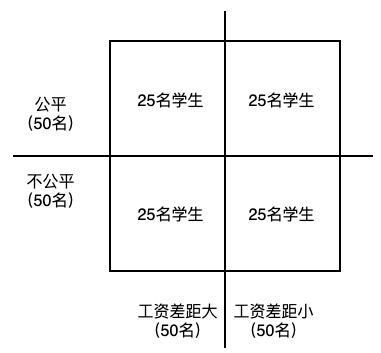
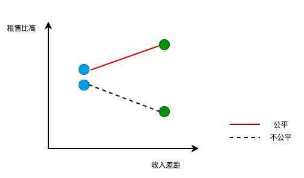

# 公平与公正对团队的好处

## 如何联系我

作者：鲁伟林

邮箱：thinking_fioa@163.com或vlinyes@163.com

版权声明：文章和记录为个人所有，如果转载或个人学习，需注明出处，不得用于商业盈利行为。

## 什么是公平和公正

管理者与员工的本质关系：价值互换。员工交付体力、脑力和时间，为公司创造价值和收益；公司得到价值和收益后，支付员工薪水。

高质量稳定交换最重要的原则：**等价交换**，等价的核心在于交换过程中的公平。

#### 公平

公平是员工对于自己的付出，而得到结果的感觉。通俗意义上的公平分为客观的公平和主观的公平，在交换过程中，主观的公平要比客观的公平更重要。

#### 公正

公正是一种针对过程的感觉。它指的是得到公平结果的过程，是否公开透明，执行过程是否一视同仁等。

## 公平的作用

### 管理者无法打破的牢笼：无法做到所有人的公平

任何管理者，都无法做到团队中每位成员主观上绝对的公平。无论制度如何制定、资源如何最大化，总会有人觉得不公平。

产生这样的本质原因是因为人类天生、不可违背的两个心理学活动

- 自我归因偏差
- 利己主机归因

#### 自我归因偏差

心理学上，个人在描述和解释社会某种行为原因时，普遍会高估个人或内因的影响，而低估环境等外在因素的作用。

#### 利己主义归因

人类在进行原因分析时，无法做到客观、公正，而是尽量使自己的利益最大化，将积极的归因于自己，消极的归因于环境。

##### 利己主义归因出现的原因

利己主义归因能帮助自己获得利益最大化结果

- 成功时能有效增强自信，获得到更多的收益；
- 失败时，能避免自尊心下降，开脱责任，避免被责罚；

**由于利己主义归因的存在，员工往往高估自己的能力和付出，而忽略身边其他人的价值付出，进而产生对与自己相关的事物都抱有乐观的预期，一旦事与愿违就触发了不公平感**

### 公平的激励作用

#### 疑问：为什么一定要尽力做到公平呢？

如上文所述，既然管理者无法做到所有人的公平，那为什么仍要尽力做到公平呢？

答案是，管理者与员工的本质关系：价值互换，稳定的价值互换重要的前提是等价交换。公平本身具有一定的激励作用，心理学家基于比对实验来证明

##### 实验场景

心理学家招聘100名应届毕业生，随机的分为两组实验组，每组50名应届生参加2个月的房产中介工作。

第一组：制定清晰的工资收入和规章制度，尽力营造团队工资分配公平的现象。

- 其中25名员工：实行0元工资制度，成功租出一套房工资增加1000元，卖出一套房工资增加10000元。
- 另外25名员工：实行底薪制度，每位员工底薪2000元，租出一套房工资增加500元，卖出一套房，工资增加7000元。

第二组：故意模糊工资收入和规章制度，每个工资发放时随机进行扣减增加，营造团队工资分配不公平的现象。

- 其中25名员工：实行0工资制度，成功租出一套房工资增加1000元，卖出一套房工资增加10000元。
- 另外25名员工：实行底薪制度，每位员工底薪2000元，租出一套房工资增加500元，卖出一套房，工资增加7000元。

##### 实验结果分析

- 公平本身具有较大的激励作用。不公平感会损害团队的积极性，降低团队的收益
- 公平的环境下，收入差距越大，团队的收益越高

## 公正的作用

公正是一种过程的感觉，公正感是可以实现的。如何做到公正，可以从公司、个人两个大方向来实现

- 公司维度
  - 规则的制定充分进行意见征求
  - 规则的执行一视同仁，不能阴阳政策，不能给某些人特权。
  - 留有申诉通道，当员工对结果公平产生质疑时，有渠道投诉和反馈
- 个人维度
  - 充分尊重员工信息知情权。涉及其切身利益的，提前沟通
  - 员工产生抱怨等情绪时，充分尊重员工，态度诚恳的沟通

#### 公正的作用

公正的最大作用：改变那些觉得自己受到不公平对待时，对吃亏原因的认识。这样，受到不公平对待的员工，一般不会过度抱怨上级领导或公司，极力降低不公平场景对团队的伤害。

## 总结

|          | 公平感                                                       | 公正感                                                       |
| -------- | ------------------------------------------------------------ | ------------------------------------------------------------ |
| 功能     | 激励作用                                                     | 维稳保健作用                                                 |
| 对象     | 针对结果                                                     | 针对过程                                                     |
| 影响因素 | 客观因素：任务分配时不公，团队贡献度不同，进而产生的价值不同 主观因素：自我归因偏差和利己主义归因心理因素 | 规则制定是否充分进行意见征求 规则执行一视同仁 留有申诉通道 尊重员工 |
| 作用     | 起到一定激励作用                                             | 维护团队稳定                                                 |

## 工作中如何运用公平和公正

- 在有限的资源条件下，要极力的维护团队中的公平感。
- 在条件允许的情况下，公平的环境下，拉开收入差距，可有效提高团队整体收益
- 绝对的公平感是无法做到的，尽力保证过程公正，来降低出现不公平场景时对团队的伤害