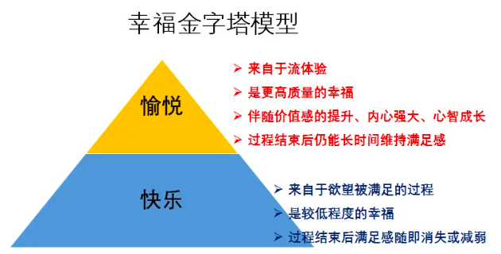
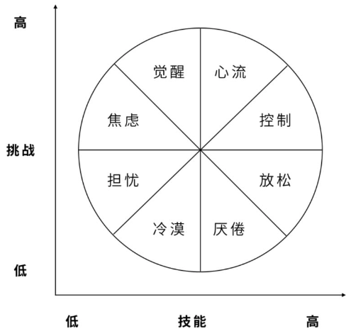

# 如何运用心流来指导工作和生活

## 如何联系我

作者：鲁伟林

邮箱：thinking_fioa@163.com或vlinyes@163.com

GitHub：https://github.com/thinkingfioa/ReadingSummary

版权声明：文章和记录为个人所有，如果转载或个人学习，需注明出处，不得用于商业盈利行为。

## 背景

2023年12月7日，参加上海交通大学张新安老师讲解的课程，重点讲述心流这一个心理学知识，特做此总结。

## 什么是心流

心流(Flow)是由心理学家米哈里希斯赞特米哈伊提出的，是一种全身心投入去做一件得心应手的事情时的心理体验。

心流体验产生时，人会有高度兴奋和充实感，是一种幸福感最强的体验。

#### 产生心流的特征

- 精神高度集中于当下的一个活动（只做一件事）
- 进入身心合一的境界
- 有强烈的驾驶感

## 心流的作用

流体验是工作和生活中幸福感最核心的指标

#### 人际关系

好的人际关系感觉，要求人的自尊感不能太低。自尊心的来源主要是两种

- 每天做的事情是否能让自己感觉有价值
- 身边人对自己的评价

流体验越多的人，自我的自尊心感觉就越强，周围人对自己的评价不再是维持自尊心的唯一条件。逐渐做到以自我为中心，待人也更加和善和宽容。

#### 学习能力和技能提升

频繁进入流体验的人，自我的专注力和自身技能会迅速得到极大提升，而且自身主管能动性、攻坚克难决心大大加强。

另外，流体验会更容易让自己坚持下去。

#### 创造力

创造力是自己在工作或生活中表现出来的一种打破常规，新的或有用的做法和想法。创造力和流体验关系密切，诸多诺贝尔奖得主表示，自己会不由自主的进入忘我的工作和研究中。

## 如何运用心流

### 通俗意义的心流

通俗意义上的心流会重点强调只有在技能适中、挑战适中的理想区域，才会产生心流。这就是心流理论上最著名的心流八通道模型。

**仿佛心流的产生是一种可遇不可求的场景。**

### 我所理解的心流

理想区域的出现，是一个可遇而不可求的机遇，对工作和生活指导意义不强。

我们无需过度关注技能和挑战相匹配的理想区域，**而应该重点关注心流的特征**。

根据心流特征，流体验产生的因素，指导自己的工作和生活。有时心流的产生是一个循序渐进的过程。

### 产生流体验的条件

决定流体验产生的条件有三个

- 任务特征
- 自控力
- 技能水平

#### 任务特征

该任务本身很有吸引力，很容易让人产生极大的兴趣，并让人集中注意力。这种任务都有三个特征：

- 明确的目标
- 清晰的规则
- 及时的反馈

如：竞技类王者荣耀等游戏，它们完全按照三个特征而设计的，非常容易让人上瘾和感兴趣。

**但因任务特征产生的流体验，是属于被动流体验**

#### 自控力

当任务无法完全达到上述三个任务特征时，要想达到流的状态，自控力就非常重要。

**自控力产生的流属于主动的流，主动的流更积极、更健康，也更具有操作性**。

自控力为什么会影响人的发展？

- 自控力会影响人的选择
  - 生活中最多的选择是“想要做（无实际意义的事）”和“应当做”的抉择
    - 想要做：短期有回报、可即时获得满足感的事。如，全民刷短视频
    - 应当做：长期看更有价值，对人生发展更有帮助的事
  - 自控力会让我们更多的选择应当做的事而不是想要做的事。帮助我们随着时间的复利，会爆发出极大的力量。
- 自控力让人更容易进入流的状态
  - 生活中有一些事一点也没有趣，也无法做到清晰的目标和规则，比如学习。自控力强的人，会全身心投入地做这些应当做事，一旦技能水平达到一定积累后，流的感觉就出来了。

**主动的流体验是靠自控力催生的**

#### 技能水平

技能水平是流体验产生的必要条件，如果没有一定的技能熟练程度，很难产生进入流的状态，所以必要的技能训练时非常重要的。

**全身心的投入 + 得心应手，进而产生流体验**。

工作中，很多应届生对自身工作、能力的认识不充分，频繁跳槽和，从而导致职业生涯上限提前到来，发展受阻，如：

- 无自控力，学习上无法体会流体验，成绩差
- -> 高中毕业工厂上班，工作脏累，价值感低 
- -> 跳槽改行，价值感暂时得到满足
- -> 跨专业技能水平不够，公司期待得不到满足，压力增大 
- -> 再跳槽，仍未能坚持达到专业技能水平 
- -> 继续跳槽，因自控力或其他原因，工作中的流体验一直没有出现
- -> 长期得不到工作带来的价值回报，持续增加工作时长投入，工作变为单一的交换投入
- -> 因自我归因偏差和利己主义归因，产生投入和回报不成正比的消极思想，工作开始不积极主动
- -> 职业生涯上限产生，发展受阻

希望有幸读到此的读者，问问自己，上面的职业生涯发展图，是否是自己工作的真实写照。

工作、生活上的流体验消失了，职业和生活的上限就出现了。

## 灵魂拷问：如何愉悦的工作和生活

心流体验的产生，是工作和生活中幸福感最核心的指标。

因工作和生活中频繁的出现流体验，让人产生高度的兴奋和充实感，幸福感得到极大满足，逐步增强自尊心，产生巨大创造力，取得了职业和生活上的成功。

所以，一直是幸福的感觉更容易让你的职业成功，而不是职业的成功让你更幸福。

对于创业者来说，如何让你的核心员工频繁的进入心流体验，决定了你的事业能否成功。

